# Leetcoder 🤓

This is **Leetcoder** – Your personal vault of LeetCode solutions! 

This project lets you store, run, and test your coding solutions like a boss 😎 🔥, all from the comfort of your favorite IDE.

## Features
- **Dynamic Problem Loading**: Load and run your LeetCode problems 🤯.
- **Color-Coded Test Results**: See at a glance which tests passed (green) and which failed (red).
- **Seamless Integration**: Works smoothly with your IDE for the ultimate coding experience.

## Usage
1. **Run the Script**: Fire up your IDE and run the `Leetcoder.py` script.
2. **Select a Problem**: Choose from your vault of problems.
3. **View Results**: Watch as your solutions are tested and results are displayed with color-coded feedback 🧑‍🎨.

```mermaid
graph TD;
    A[Import Test Cases] --> B[Create Solution.py];
    B --> C[Run from Menu];
    C --> D[?????];
    D --> E[become LeetCode master 🎉];
```

---
CHANGELOG

[2024-08-26] - Version 0.3.0
    
 	•	Added wrap-around for long inputs/outputs
    •	Added list formatter to solve weird whitespace things for comparision
    •	Enabled parsing and construction of n-ary tree structures
    
[2024-08-25] - Version 0.2.0

   	•	Introduced a new parsing mechanism to automatically handle different types of problem inputs.
	•	Added a mapping system (PARSER_MAPPING) to link specific problems to their corresponding parsing methods.

[2024-08-24] - Version 0.1.0

    •	Initial Release: Set up the basic structure of the Leetcoder project, including:
    •	Problem menu with color-coded difficulty levels (easy, medium, hard).
    •	Problem runner that executes solutions based on test cases.
    •	Modularised project structure with separate files for the menu, runner, and problem loader.